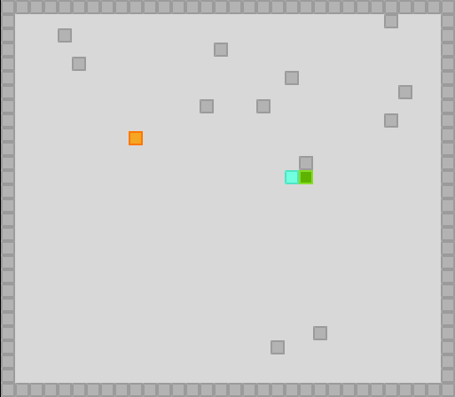

# Nineteen Below

This is a 2d puzzle game you can play in a web browser.

## Gameplay
The game consists of an infinite amount of rounds. Each round the game field will look slightly different.

The playing field is a two dimensional grid. The field is surrounded by walls. On the playing field you will find the following objects.

*  This orange block can be controlled by the player.
*  This turquoise block can be pushed around. Once pushed it will move in a straight line until it hits a wall. A round is won, when it is standing still on the goal.
*  The goal of each round is to bring the turquoise block to a stop on this green goal.
*  This dark gray block is a wall. You will find several walls placed on the field.

The player’s block can push the orange block. When pushing the orange block towards a wall, you want to think about what moves will be possible after your move. You want to get the orange block into a position that allows you to push it into the goal and come to a stop by colliding with a wall behind it. You can only push the block into the opposite direction from which you are approaching it. Beware that a wrong move might get the orange block stuck.

## Controls
You control the orange player block.
* `W` or `Arrow up` - move upwards
* `A` or `Arrow left` - move left
* `S` or `Arrow down` - move downwards
* `D` or `Arrow right` - move right
